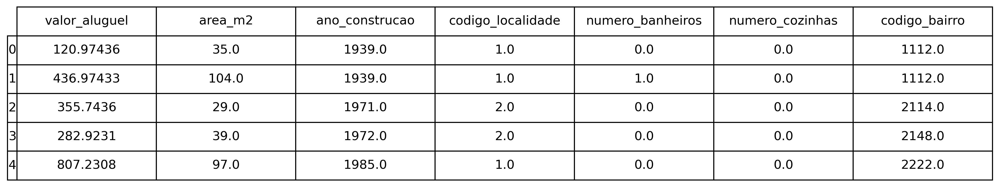
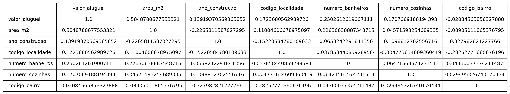
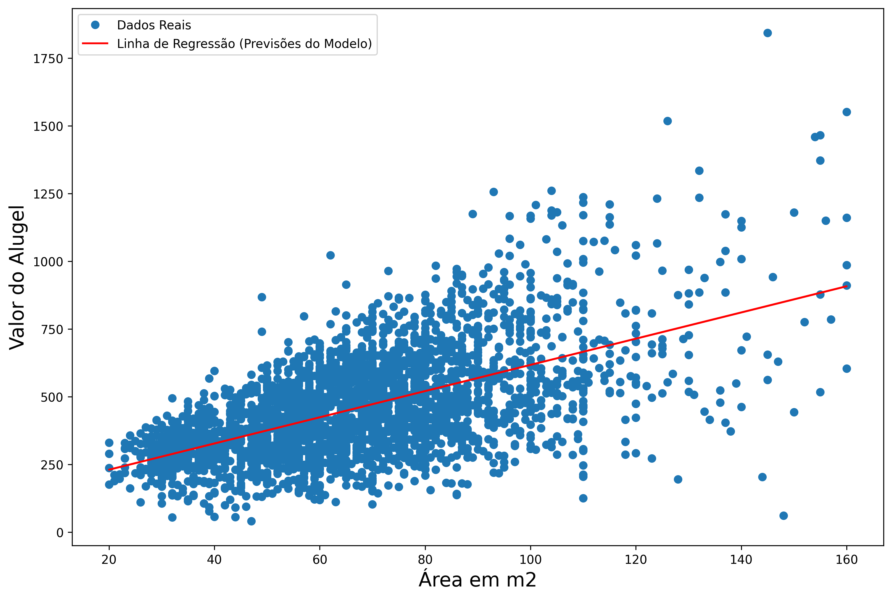

# Análise Estatística com Statsmodels

## Problema

Existe alguma relação entre a área de imóveis (em metros quadrados) e o valor do aluguel em uma determinada cidade? Caso exista relação, como é possível mensurá-la?

## Sobre o dataset

O dataset é composto pelas as seguintes informações:

Para resolver o problema, é preciso analisar o coeficiente de correlação entre as variáveis.

O coeficiente de correlação é uma medida estatística que indica a força e a direção da relação linear entre duas variáveis numéricas, variando entre -1 e 1, onde:
- Coeficiente = 1 -> indica uma correlação linear perfeita positiva. Quando uma variável aumenta, a outra aumenta na mesma proporção.
- Coeficiente = -1 -> indica uma correlação linear perfeita negativa. Quando uma variável aumenta, a outra diminui na mesma proporção.
- Coeficiente = 0 -> não há correlação linear entre as duas variáveis.

## Regressão Linear

O algoritmo escolhido para a resolução do problema, foi a Regressão Linear. Essa técnica é utilizada para modelar a relação entre uma variável dependente (também chamada de variável resposta ou variável alvo) e uma ou mais variáveis independentes (também chamadas de variáveis explicativas ou preditoras). Para o problema em questão a variável alvo é o **valor do aluguel** e a variável preditora é a **área em m2**.

A Regressão Linear tem como objetivo estimar os coeficientes da equação que melhor descreve essa relação, minimizando a soma dos erros quadráticos entre os valores observados e os valores previstos pelo modelo.

## Modelo OLS (Ordinary Least Squares) com Statsmodels
O método utilizado foi o sm.OLS(y, x) que é função do pacote Statsmodels. Essa função é usada para ajustar um modelo de regressão linear, minimizando a soma dos erros quadráticos entre os valores observados e os valores previstos pelo modelo.

Quaisquer dúvidas sobre a função, acesse a [documentação](https://www.statsmodels.org/dev/generated/statsmodels.regression.linear_model.OLS.html).

## Conclusão

Analisando o gráfico, é possível claramente que existe uma forte relação entre as duas variáveis. Entretanto, apenas a área dos imóveis não é suficiente para explicar a variação no valor do aluguel, pois o modelo obteve um coeficiente de determinação (R²) de apenas 0.34.

O ideal seria usar mais variáveis de entrada para construir o modelo a fim de compreender se outros fatores influenciam no valor do aluguel. 