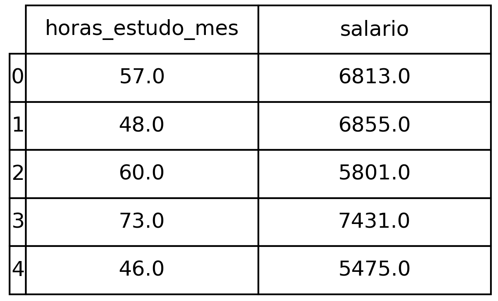
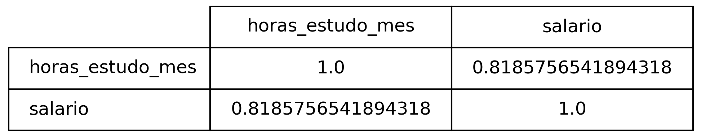
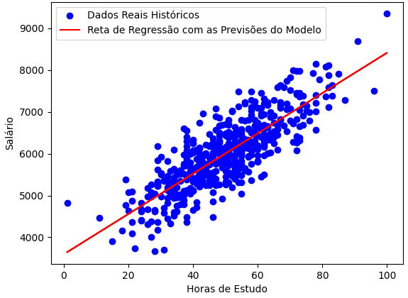

# Predição com Regressão Linear

## Problema

Usando dados históricos é possível prever o salário de alguém com base no tempo dedicado aos estudos em horas por mês?

## Sobre o dataset

O dataset é composto pelas as seguintes informações:

Para resolver o problema, é preciso analisar o coeficiente de correlação entre as duas variáveis.

O coeficiente de correlação é uma medida estatística que indica a força e a direção da relação linear entre duas variáveis numéricas, variando entre -1 e 1, onde:
- Coeficiente = 1 -> indica uma correlação linear perfeita positiva. Quando uma variável aumenta, a outra aumenta na mesma proporção.
- Coeficiente = -1 -> indica uma correlação linear perfeita negativa. Quando uma variável aumenta, a outra diminui na mesma proporção.
- Coeficiente = 0 -> não há correlação linear entre as duas variáveis.

## Regressão Linear

O algoritmo escolhido para a resolução do problema, foi a Regressão Linear. Essa técnica é utilizada para modelar a relação entre uma variável dependente (também chamada de variável resposta ou variável alvo) e uma ou mais variáveis independentes (também chamadas de variáveis explicativas ou preditoras). Para o problema em questão a variável alvo é o **salario** e a variável preditora é a **horas de estudo por mês**.

A Regressão Linear tem como objetivo estimar os coeficientes da equação que melhor descreve essa relação, minimizando a soma dos erros quadráticos entre os valores observados e os valores previstos pelo modelo.

Quaisquer dúvidas sobre esse algoritmo em python, segue a [documentação](https://scikit-learn.org/stable/modules/generated/sklearn.linear_model.LinearRegression.html).

## Conclusão

Como é a primeira versão do modelo e sem otimização de hiperparâmetros, o valor do coeficiente de determinação (R²) obtido é razoável, 0.59.

O ideal seria testar e criar outras versões do algoritmo para aumentar esse valor do coeficente de determinação.